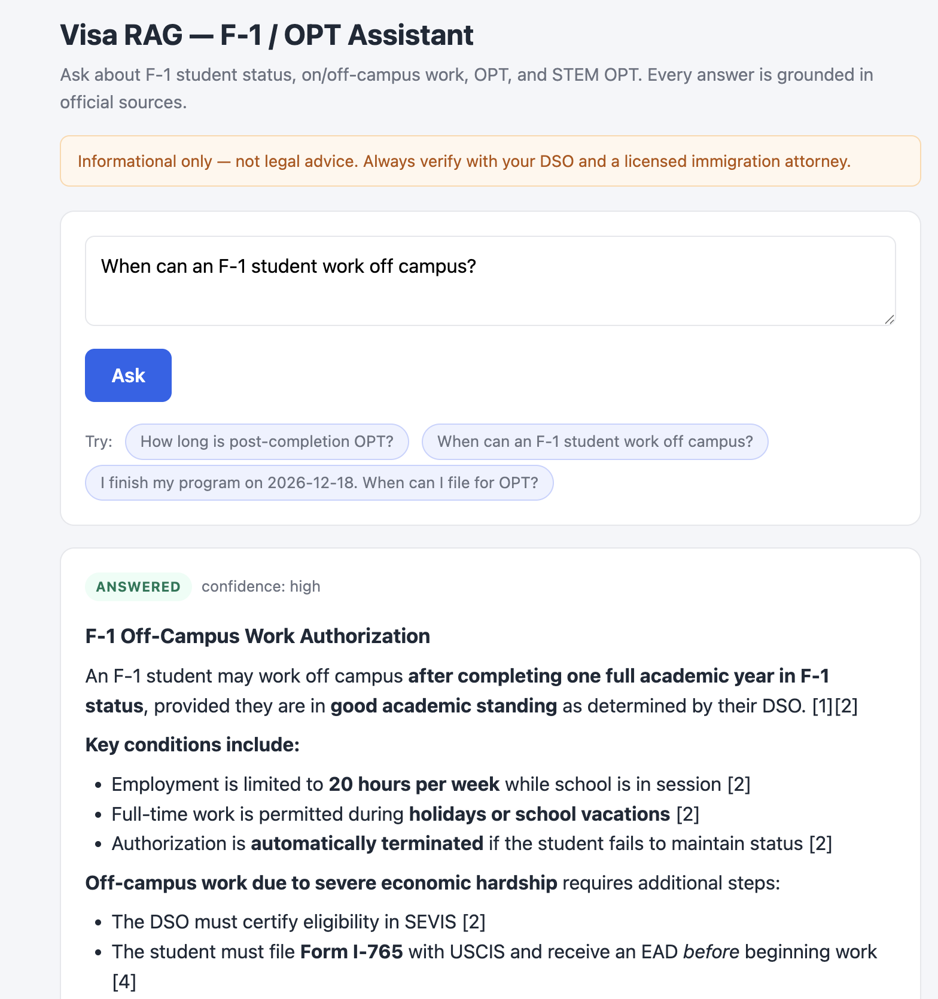
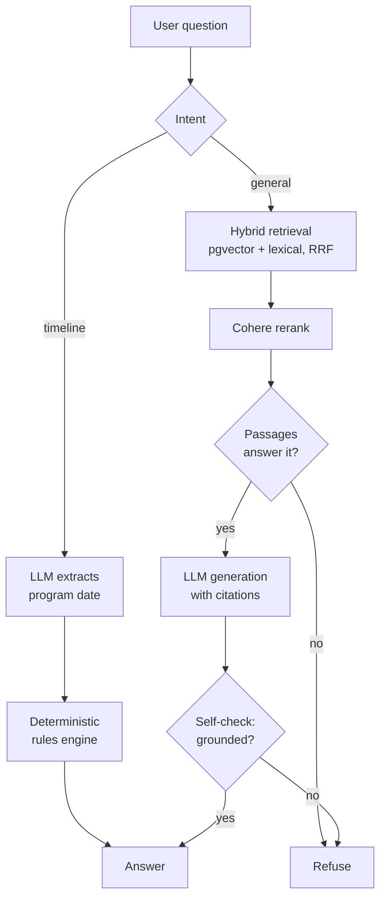

# Visa RAG — F-1 / OPT / STEM OPT Assistant

> **Informational only — not legal advice.** Always verify with your school's DSO
> and a licensed immigration attorney before making decisions.

A retrieval-augmented assistant that helps international students navigate F-1
student status, on/off-campus employment, OPT, and the STEM OPT extension.

Unlike a general chatbot, it is **built for a high-stakes domain**: every answer
is grounded in official sources with passage-level citations, the system refuses
when the sources don't cover a question, all date arithmetic is done by a
deterministic rules engine (never the LLM), and it tracks the user's personal
case so it can say *"here's where you are and what to do next."*



## What it does

- **Grounded Q&A** — answers F-1/OPT questions using only retrieved official
  passages, with inline `[n]` citations to the exact USCIS / 8 CFR / SEVP source.
- **Refuses when it should** — out-of-scope or unsupported questions get a
  refusal, not a confident hallucination.
- **Deterministic timeline** — date/deadline questions are routed to a rules
  engine that computes OPT/STEM filing windows from the cited regulations.
- **Personal case tracker** — a saved profile drives a progress view: current
  stage, next action, and countdowns to upcoming deadlines.
- **Conversation-aware** — when a message reveals a case change ("I just filed
  my I-765"), the app *suggests* a profile update for the user to confirm.

## Architecture

The query pipeline routes each question to one of two paths — the LLM is used
for *understanding*, never for date math:



**Ingestion** (offline): official PDFs → text extraction (`pypdf`) →
section-aware chunking → BGE embeddings → stored in Postgres/pgvector with a
two-tier label (authoritative vs. practitioner) and provenance metadata.

**Serving**: a FastAPI app and a Postgres + pgvector database run as two
containers via Docker Compose; the app reaches the database over the compose
network.

## Evaluation

A golden-set harness (`src/eval/`) measures three metrics across general,
timeline, and deliberately out-of-scope questions:

| Metric | Result |
|---|---|
| Routing accuracy (right pipeline / mode) | 16/16 = 100% |
| Key-fact coverage (answers contain expected facts) | 15/15 = 100% |
| Out-of-scope refusal rate | 4/4 = 100% |

The harness first surfaced a real bug: out-of-scope refusal was only **50%** —
immigration-adjacent questions (H-1B cap, marriage green card) slipped past the
embedding relevance filter. Adding an LLM **answerability gate** (which reads the
retrieved passages and judges whether they actually contain the answer) raised
refusal to **100%** with no in-scope regressions. See `docs/eval_results.md`.

> The 16-question set is a seed; it is designed to grow toward ~100 with
> adversarial cases.

## Tech stack

- **Backend**: Python, FastAPI
- **Database**: PostgreSQL + pgvector (HNSW index)
- **Retrieval**: hybrid dense + lexical search, Reciprocal Rank Fusion, Cohere rerank
- **Embeddings**: BGE (`sentence-transformers`)
- **Generation**: Claude (Anthropic API)
- **Ingestion**: `pypdf`, section-aware chunking
- **Frontend**: single-page HTML/CSS/JS, served by FastAPI
- **Infra**: Docker Compose

## Getting started

```bash
cp .env.example .env                  # add ANTHROPIC_API_KEY and COHERE_API_KEY
docker compose up -d                  # starts postgres (schema auto-applied) + app
curl http://localhost:8000/health     # -> {"status":"ok"}
```

Then open **http://localhost:8000/**. To load the knowledge base, download
official source PDFs and run the ingestion scripts (see `docs/添加文档手册.md`):

```bash
docker compose exec app python -m src.ingestion.parse_pdf \
    data/raw/<doc>.pdf --output data/processed/<doc>.jsonl
docker compose exec app python -m src.ingestion.embed_and_index \
    --jsonl data/processed/<doc>.jsonl --prefix "<citation prefix>" \
    --source-url "<url>" --title "<title>" --publisher USCIS --tier 1
```

Run the evaluation suite:

```bash
docker compose exec app python -m src.eval.run_eval
```

## Project layout

```
visa_rag/
├── db/init.sql                  # pgvector schema (documents, chunks, profile)
├── src/
│   ├── main.py                  # FastAPI app + web UI route
│   ├── ingestion/               # parse_pdf, chunk, embed_and_index
│   ├── retrieval/               # hybrid_search, rerank
│   ├── generation/rag.py        # intent routing, RAG, self-check, answerability gate
│   ├── rules/opt_timeline.py    # deterministic OPT/STEM date math
│   ├── profile/                 # store, progress, infer (conversation-driven)
│   ├── eval/                    # golden set + harness
│   └── web/index.html           # single-page frontend
└── docs/                        # eval results, milestones, guides
```

## Design decisions

- **HNSW, not IVFFlat** — IVFFlat partitions vectors into lists and probes only
  a few; on a small corpus most lists are empty and recall is unstable. HNSW is
  reliable at any corpus size.
- **LLM understands, rules engine computes** — immigration deadlines are
  high-stakes and LLMs miscompute dates; the LLM only extracts parameters, all
  date math is deterministic Python that cites its CFR source.
- **Answerability gate + self-check** — two independent "should we answer?"
  checks: one before generation (do the passages contain the answer?) and one
  after (is the drafted answer grounded?).
- **Detect → suggest → confirm** — the app never silently changes the user's
  case state; it surfaces a suggestion and the user confirms.

## Limitations

- Single-user profile (no authentication) — multi-user accounts are a deliberate
  future step.
- Knowledge base currently spans 5 official sources; section detection is coarse
  for non-Policy-Manual PDFs.
- The evaluation set is a 16-question seed.
- Runs locally via Docker; not yet deployed to a public URL.
- **Informational only — not legal advice.**
